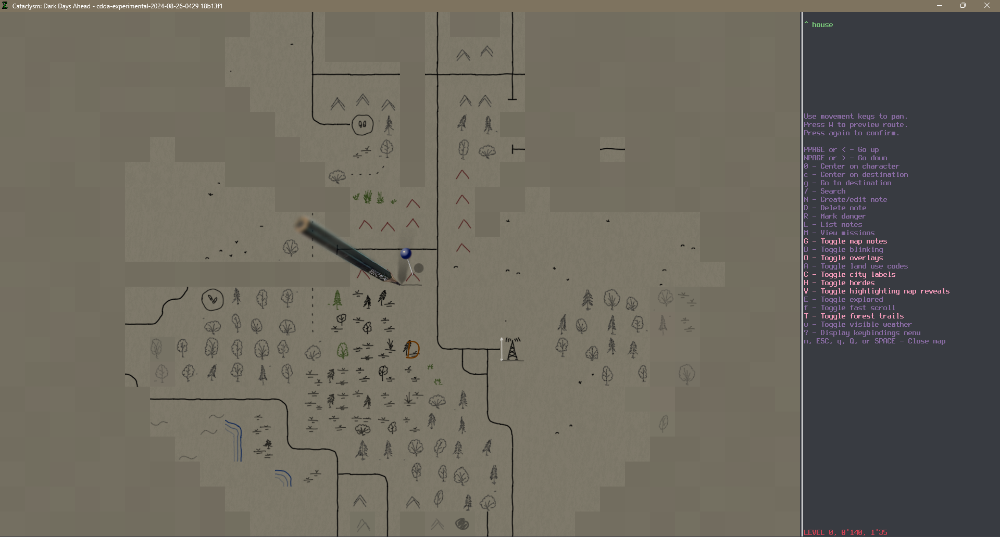
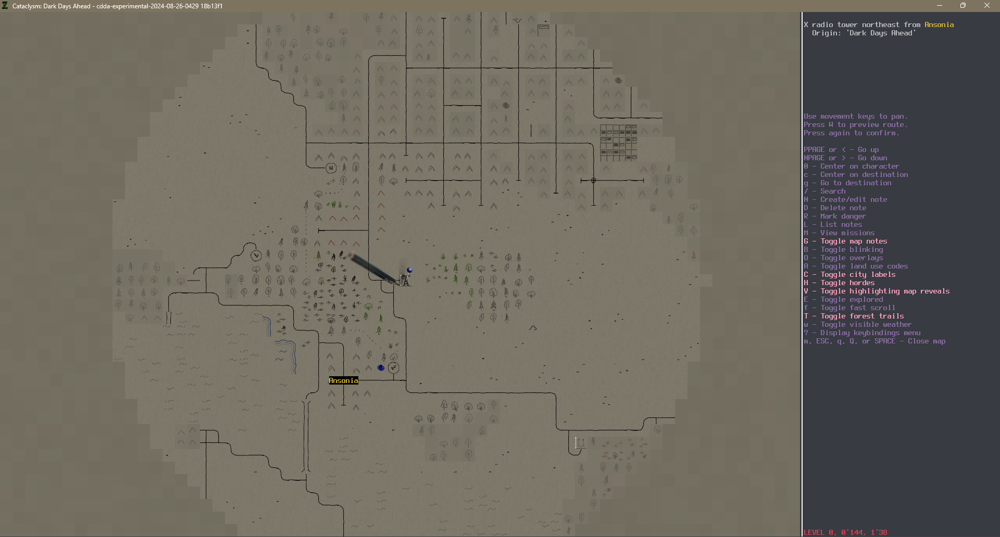
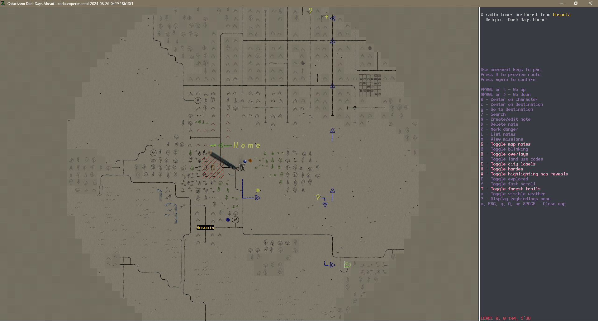
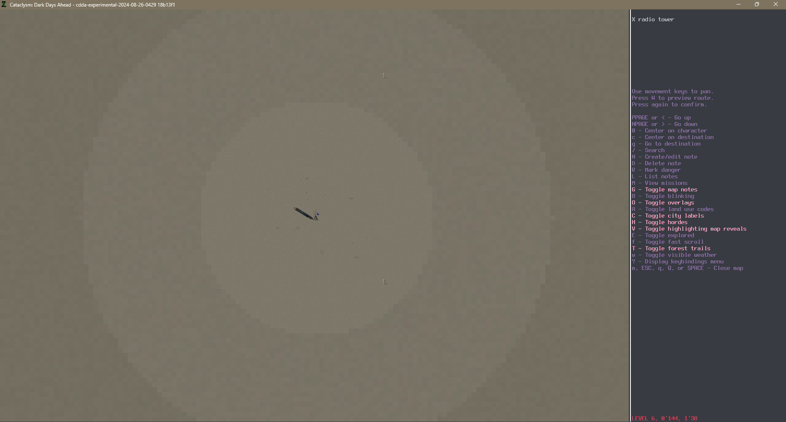
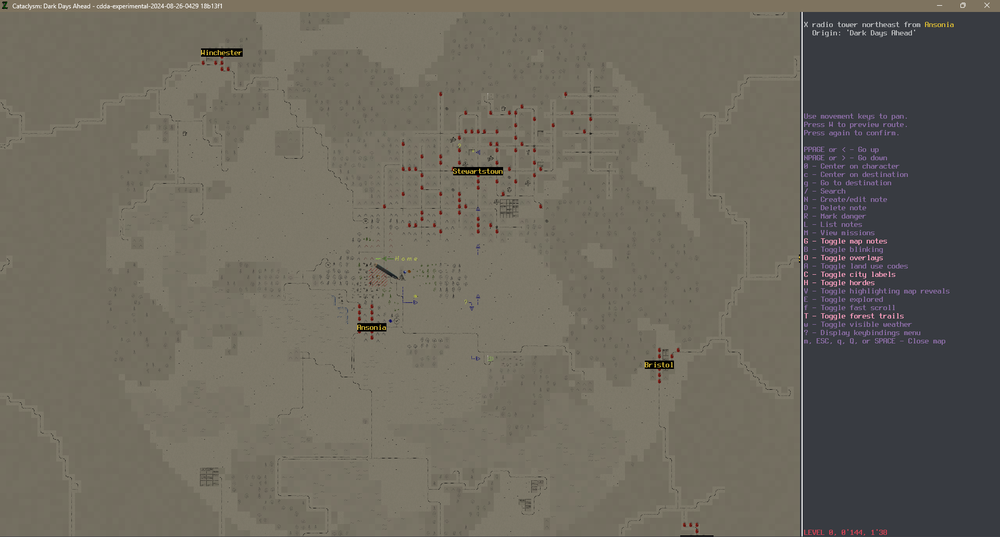
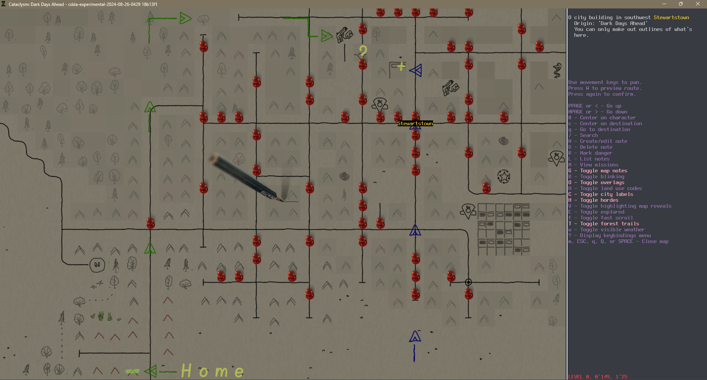

# Pen And Paper Overmap tileset

I'm excited to introduce you all to my new overmap tileset.

Some time ago, I contributed to the SurveyorMap tileset (thanks to @curstwist (u/Turn478) for the opportunity). The discussion in [this post](https://www.reddit.com/r/cataclysmdda/comments/rw3q5n/psa_update_to_surveyors_map_style/) was very insightful.
*SM tileset is aimed to represent real buildings shapes and terrain tiles seasoned with USGS.*

When creating this tileset, I aimed to achieve the following goals:

1. **Showcase the quality of Cataclysm: Dark Days Ahead**: This game offers diverse graphics, and it's not necessary to stick to Pixel Art.
2. **Enhance immersion**: Some time ago, @I-am-Erk (u/I-am-Erk) mentioned that he envisioned the map as hand-drawn, with the survivor drawing it as they progress. I tried to create this feeling.
3. **Create a clear and understandable map**: Through careful consideration of canvas size and stylistic choice, I create tileset that empower the player to quickly understand the surrounding.
4. **Avoid brightness mismatch**: I adjusted brightness to prevent blinding effects when switching from darker main tilesets. It is also possible to adjust it on the player side. Check documentation link below.
5. **Encourage interactivity**: This tileset encourages the player, acting as a survivor, to interact more actively with the map.

Below I will show several screenshots, talk about the possible behavior of the player, demonstrate the current state of the tileset, and list known issues.

## Gameplay

In this example, our player started somewhere on the outskirts of the city. This is what they will see if they climbs onto the roof.

*The first thing that catches the eye is the cursor. It is designed as a pencil, with the tip pointing to the bottom left corner of the map tile. A short pencil line highlights this tile and moves with the pencil.*

*A pin with a blue head indicates the player.*

We can see several residential houses around us (brown `^`). In the distance, some structures are visible, but we don't know what they are (gray double `^`). If we get closer and our confidence increases, they will either turn into brown signs (residential buildings) or into miniature black drawings (such as the tower southeast of the player).

Some trees are marked with a pencil, and some with a green pen. This is related to how confident we are in what we see. While we can distinguish a trail from a dense forest up close, we can't do so at a certain distance. To the east of the player, a forest begins, and our confidence in what is there quickly decreases. The lines become more transparent, and the background darker.

Directly to the south, there is an auto note - a brown letter `D` - which is a `Dermatiks nest`. Probably not the best place to visit. However, between the small forest and this `D`, a tall structure is marked with a white vertical line. It's a radio tower. It would be interesting to climb up:

The view from the radio tower is mesmerizing:

- To the south, it looks like there's a river with a bridge over it, but the banks are not visible.
- To the southeast, there's another bright white mark - something tall, yay!
- The forest to the east turned out to be small, and there's some outcropping visible on its edge. It's not far, so I can visit it.
- To the west, there doesn't seem to be anything interesting, but to the north, there's a sizable city with a large building visible. Near the top edge of the screenshot is something looking like a warehouse and some kind of pit. I wonder what's there?

It might be worth marking a few points on the map:

Let's draw a line with a green highlighter - this is the starting house. And let's label it - `Home`.
I'll mark the Dermatiks nest with red diagonal strokes and try to avoid it.

The brown "dot" is an auto note for "Dead vegetation", and the yellow one is a "Sand patch."

I'll add my own notes - placing yellow question marks where I think there's something interesting and a yellow plus sign on the building I want to visit.

I'll mark the tall structure to the south with a smiley face. And I'll plot a route - blue marks will help me stay on track, even if I play again a week later.

Oh! I was so focused on drawing the map that I almost missed the paper pinned down by binoculars at the top of this radio tower. I'll use both!

> [!NOTE]
> I recommend toggling off blinking on the map (`B`).

*This screenshot shows how far you can see and how small the cursor is when the map is zoomed out.*

Here you can see three different areas:

1. **Central area**: This is where the player can:
   - Be certain about some buildings
   - View details about some buildings
   - View outlines of distant objects
2. **Dimmed area**: This is where the player can only get a vague idea of what is seen.
3. **Dark area**: Unknown territories. There can be dragons.

Even when zoomed out, you can be certain where the cursor is and if there are any tall buildings. Can you find two in this screenshot?

Let's take a look at what's on the ground using the binoculars I just found.

Well, roads on the map also provide information about hordes. That's good. I should reconsider my route accordingly.

Instead of going through the city, I should head back home and then walk to the northern outskirts of the city, turning right into the nearby forest. From there, I can go to the gun shop for some weapons, looting houses along the way.

## Known issues

I think you may have already noticed a few issues even from these screenshots. I'll try to list all the known ones.

1. Not all objects have sprites in this tileset yet. Currently, I've completed only 51% of the sprites. However, I think it's already possible to try playing with this tileset.
2. Not all sprites are randomized. For example, tacks should ideally be placed with a "random" offset, but the screenshots show that only the first sprite is used. This also applies to autotravel marks or notes about roads/objects added from someone else's map.
3. The river banks exhibit a minor issue near the bridges, and the corners of lake and ocean shores are incorrect. Unfortunately, these issues cannot be resolved from within the tileset itself.
4. The pins tilt with the player’s rotation, resulting in inconsistent shadows.
5. Zombie hordes, for some reason, are displayed as the most dangerous (10 out of 10), even though I have prepared 4 different colors for tacks.
6. Unfortunately, to draw those lines with arrowheads or to write `Home`, you need as many notes as there are elements in the line or label. It would be great to have the ability to differentiate notes from the those map marks. A good example here is the marks around the Dermatik Nest.
7. While using the map, I often wanted to use the mouse for drawing, but no - the keyboard is still the best friend.

## Additional Materials

I tried to document everything in detail, including how to use the map during gameplay, how to change its brightness or cursor, and how to contribute.

https://github.com/I-am-Erk/CDDA-Tilesets/blob/master/doc/style/PenAndPaper/summary.md

Thank you very much for reading.
